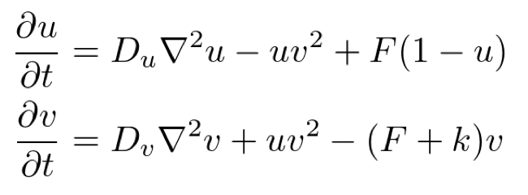
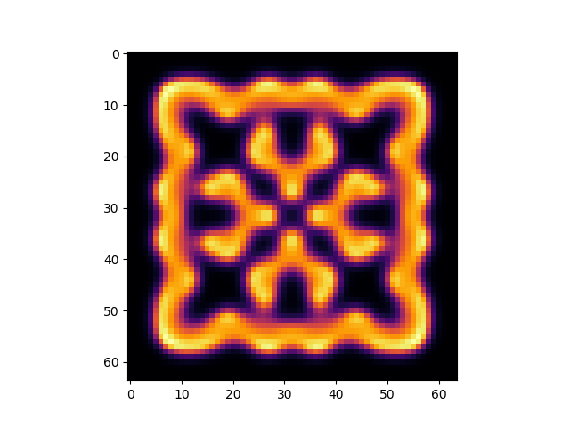
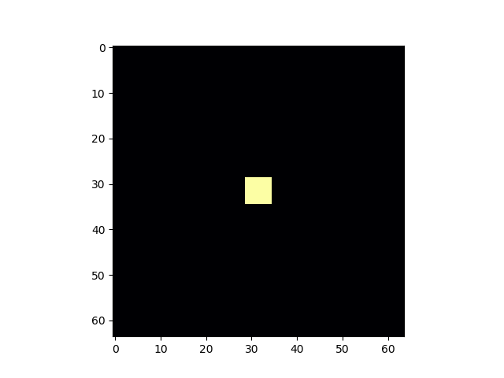
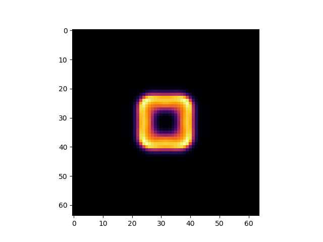
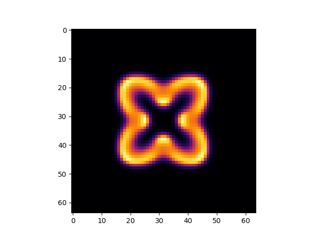
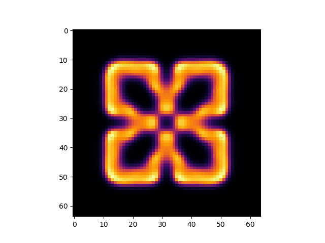
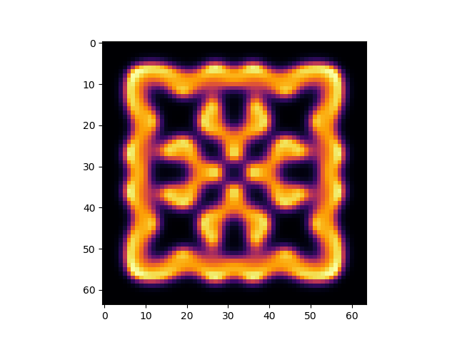

# Python implemenation of Gray-Scott Model

[](LICENSE)

## Summary

A simulation of Gray-Scott model which is one of the famous reaction-diffusion systems.
There two components in the system, u and v.

The governing equation is as follows.



$$
\begin{aligned}
\frac{\partial u}{\partial t} &= D_u \nabla^2 u - uv^2 + F(1-u) \\
\frac{\partial v}{\partial t} &= D_v \nabla^2 v + uv^2 - (F+k)v
\end{aligned}
$$

* Du, Dv: diffusion constants for u and v
* F, k: some constants

The above system denotes the chemical reaction of U + 2 V -> 3V and V -> P.
We choose (Du, Dv, F, k) as (0.1, 0.05, 0.04, 0.06075).

## Usage

Run the following command.

```sh
python gs.py
```

Then you will have the following image.



If you want some animation, run the following.

```sh
pythong gs_anime.py
```

Then you will have images from `gs_00.png` to `gs_99.png`. Some of them look as follows.







You can generate animation gif by some tool such as ImageMagick.

```sh
convert gs*.png gs.gif
```